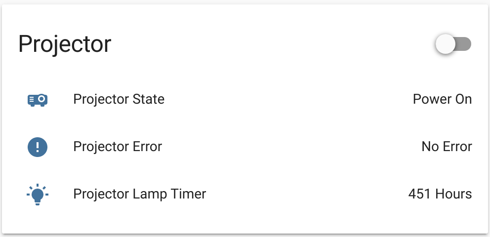
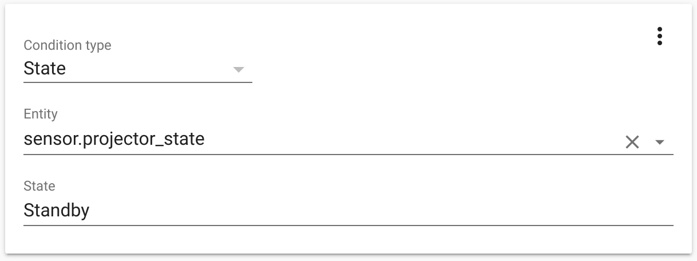
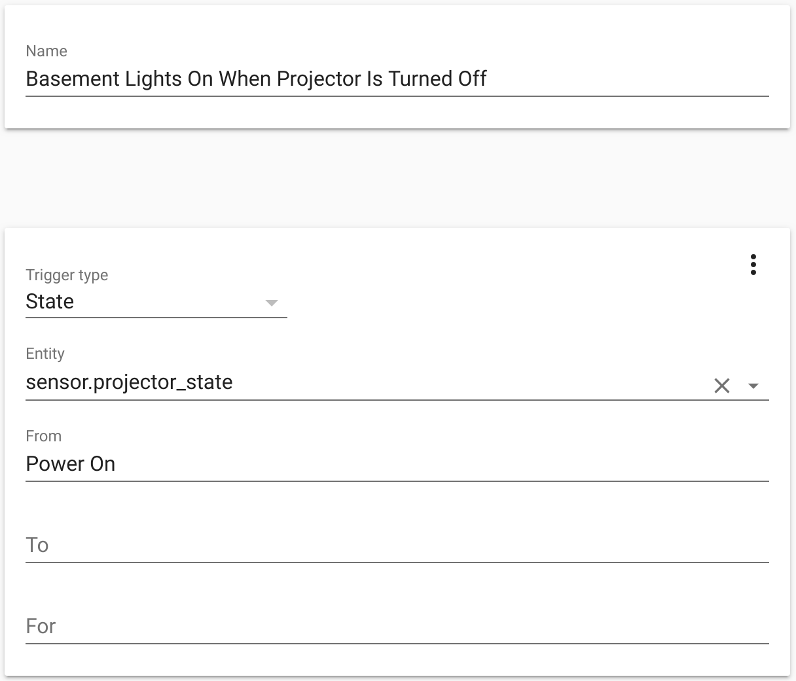
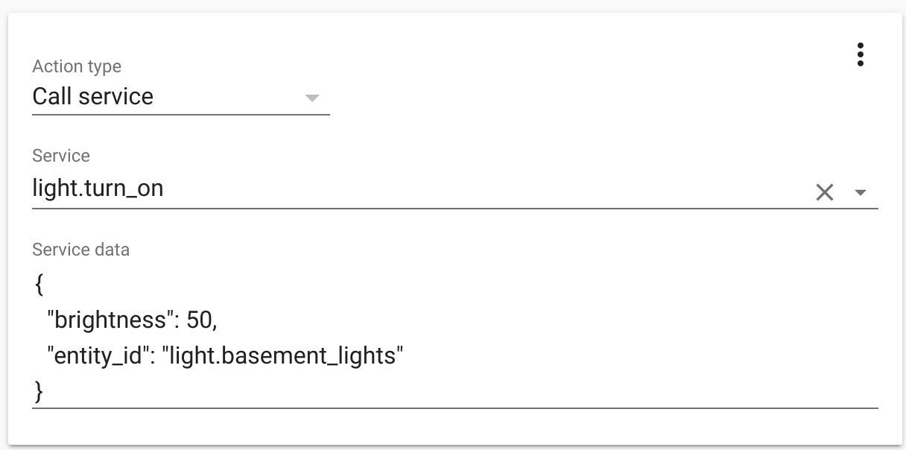

# Projector Status Pusher for HomeAssistant
This collection of scripts allows for hardware (a RaspberryPi, for example) connected to a projector to push the projector's status to HomeAssistant.

A sample hardware configuration would be a RaspberryPi with a usb->serial adapter connected to the RS232 port of a projector.
The user would then clone this repo, create a configuration based on [the sample config](config/sample.json), replacing the necesary values, and running [install.sh](install.sh) (passing the created configuration file as an argument).

The resulting card will be created in HomeAssistant:

## HomeAssistant Automation
The user can create automations based on the states within the Projector card.  For instance, unless the Projector is in `Standby`, the user can prevent Presence Sensors from turning the lights on with a Condition:

Also, if the Projector goes from `Power On` to any other state, the user can turn the lights on dimmed:

